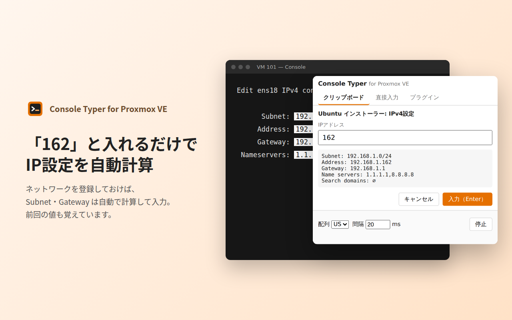

# Console Typer for Proxmox VE

Proxmox VE の noVNC コンソールに、保存しておいたテキストや IP 設定を**キーボード入力として自動で打ち込む** Chrome 拡張機能です。
コピー＆ペーストが使えない VM のコンソール（OS インストーラー、ログイン画面、レスキューシェルなど）で、長いコマンドや IP 設定を手で打つ手間をなくします。



[English summary](#english)

## できること

- **クリップボード** — よく使う入力を保存して、ワンクリックでコンソールに入力
- **IPの自動計算** — ネットワークを登録しておけば、`162` と入れるだけで Subnet・Address・Gateway を計算して入力
- **フォームの一括入力** — 欄と欄の間で Tab を押しながら、インストーラーの画面をまとめて入力
- **プラグイン** — 入力のひな形を JSON で追加・共有（[書き方](docs/PLUGINS.md) / [例](plugins/)）
- **毎回入力** — `192.168.1.{?}` のように、変わる部分だけクリック時に入力。前回の値も記憶
- **特殊キー** — `{TAB}` `{ENTER}` `{ESC}` `{BS}` `{UP}` `{DOWN}` `{WAIT 500}` など
- **US / JIS 配列**、入力間隔の調整、途中停止

入力内容はお使いの PC の中（`chrome.storage.local`）にだけ保存され、外部には送信しません。→ [プライバシーポリシー](docs/privacy.html)

## インストール

### Chrome ウェブストアから

（公開後にリンクを追加）

### ソースから

1. [Releases](../../releases) から `console-typer-for-proxmox-x.y.z.zip` をダウンロードして展開
   （またはこのリポジトリを clone して `src/` フォルダを使う）
2. Chrome で `chrome://extensions` を開き、右上の「デベロッパーモード」をオン
3. 「パッケージ化されていない拡張機能を読み込む」で、展開したフォルダ（または `src/`）を選ぶ

## 使い方

1. Proxmox VE で VM の「Console」（noVNC）を開く
2. 入力を始めたい欄（例: Subnet、Your name）にカーソルを置く
3. 拡張機能のアイコンを開き、項目をクリック（必要なら IP などを入力して Enter）

| 標準プラグイン | 使う画面 |
|---|---|
| Ubuntu インストーラー: IPv4設定 | 「Edit IPv4 configuration」— Subnet 欄から |
| Ubuntu インストーラー: プロフィール | 「Profile configuration」— Your name 欄から |
| Linux: ip コマンドで一時的にIPを設定 | ログイン済みのシェル |

### 注意

- 入力できるのは ASCII（英数字・記号・スペース・改行・タブ）のみです
- 記号がずれるときは、拡張機能の「配列」を VM 側のキーボード配列（US / JIS）に合わせてください
- 文字が抜けるときは「間隔」を 50〜100ms に増やしてください
- LXC コンテナなどの xterm.js コンソールは対象外です
- 保存したデータ（パスワードを含む）は暗号化されません

## 開発

Node.js 20 以上が必要です。

```sh
npm install
npx playwright install chromium   # E2Eテストと画像生成で使う
```

| コマンド | 内容 |
|---|---|
| `npm test` | 単体テスト（IP計算、プラグイン検証、ビルド設定） |
| `npm run test:e2e` | ブラウザでのテスト（ポップアップ操作、キーイベント、拡張機能の読み込み） |
| `npm run build` | ストア提出用の zip を `dist/` に作成 |
| `npm run check:plugin -- plugins/xxx.json 162` | プラグインJSONを検証し、試しに計算した結果を表示 |
| `npm run assets` | アイコン（`src/icons/`）とストア用画像（`store/`）を再生成 |

インストール済みの Chrome / Chromium を使うときは `CHROME_PATH=/path/to/chrome npm run test:e2e` のように指定できます。

拡張機能の読み込みはビルド不要です。`src/` を「パッケージ化されていない拡張機能」として読み込み、変更したら拡張機能カードの ↻ を押してください。

### フォルダ構成

```
src/                 拡張機能本体（このフォルダがそのまま拡張機能）
  manifest.json
  popup.html/.css/.js  ポップアップUIとキー入力処理
  plugins.js           プラグインの仕組み（式・IP計算・検証）と標準プラグイン
  icons/
plugins/             プラグインの例（JSON）
docs/
  PLUGINS.md           プラグインの書き方
  privacy.html         プライバシーポリシー（GitHub Pages で公開）
  STORE-LISTING.md     Chrome ウェブストアの申請内容
store/               ストア用画像（npm run assets で生成）
scripts/             ビルド・画像生成・プラグイン検証
test/unit/           単体テスト
test/e2e/            ブラウザテスト
```

### リリース

```sh
# CHANGELOG.md の Unreleased を新しいバージョンの見出しに書き換えてから
npm version minor        # package.json と src/manifest.json のバージョンを上げてコミット＆タグ
git push --follow-tags   # → GitHub Actions がテストして Release に zip を添付
```

zip を [Chrome ウェブストアのデベロッパー ダッシュボード](https://chrome.google.com/webstore/devconsole) にアップロードします。
掲載文・権限の説明などは [docs/STORE-LISTING.md](docs/STORE-LISTING.md) にまとめてあります。

### プライバシーポリシーの公開（GitHub Pages）

リポジトリの Settings → Pages で「Deploy from a branch」→ `main` / `/docs` を選ぶと、
`https://<ユーザー名>.github.io/<リポジトリ名>/privacy.html` で公開されます。この URL をストアの申請に使います。

## コントリビュート

不具合の報告やプラグインの追加を歓迎します。→ [CONTRIBUTING.md](CONTRIBUTING.md)

## ライセンス

[MIT](LICENSE)

Proxmox は Proxmox Server Solutions GmbH の登録商標です。本拡張機能は同社とは関係のない非公式ツールです。

---

## English

**Console Typer for Proxmox VE** is a Chrome extension that types saved text into the Proxmox VE noVNC console as real keystrokes — useful where copy & paste doesn't work (OS installers, login prompts, rescue shells).

- Snippets you can send with one click
- Automatic IP math: type `162` and Subnet / Address / Gateway are filled in
- Fill installer forms by pressing Tab between fields
- JSON plugins for your own templates ([format](docs/PLUGINS.md), Japanese)
- Special keys, US / JIS layouts, adjustable delay
- Everything stays on your machine; no network access

Development: `npm install && npx playwright install chromium`, then `npm test`, `npm run test:e2e`, `npm run build`.
Load `src/` as an unpacked extension for local testing.

Proxmox is a registered trademark of Proxmox Server Solutions GmbH. This project is not affiliated with Proxmox Server Solutions GmbH.
